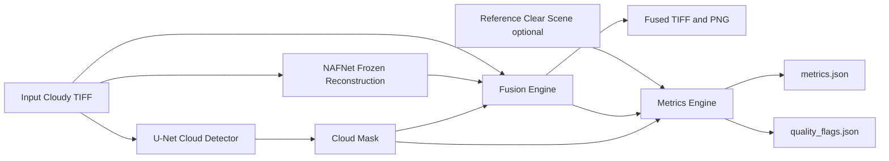

# Architecture Diagram

```mermaid
flowchart LR
  A[Input Cloudy TIFF] --> B[U-Net Cloud Detector]
  B --> C[Cloud Mask]
  A --> D[NAFNet Frozen Reconstruction]
  C --> E[Fusion Engine]
  D --> E
  A --> E
  E --> F[Fused TIFF and PNG]
  C --> G[Metrics Engine]
  E --> G
  H[Reference Clear Scene optional] --> G
  G --> I[metrics.json]
  G --> J[quality_flags.json]
```
