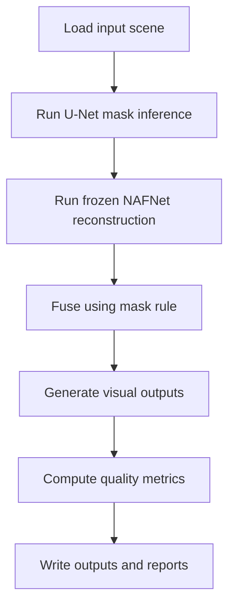

# Workflow Diagram

```mermaid
flowchart TD
  S1[Load input scene] --> S2[Run U-Net mask inference]
  S2 --> S3[Run frozen NAFNet reconstruction]
  S3 --> S4[Fuse using mask rule]
  S4 --> S5[Generate visual outputs]
  S5 --> S6[Compute quality metrics]
  S6 --> S7[Write outputs and reports]
```
